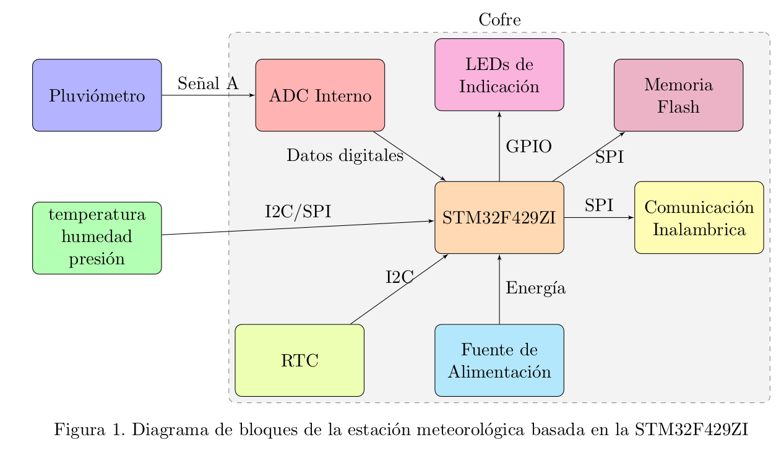

# Estación Meteorológica, Selección del proyecto a implementar

*autor:* Luis Gómez

La selección del proyecto a implementar es un paso crucial en el desarrollo de cualquier sistema embebido [@marwedel2021embedded]. Este proceso inicial determina no solo el alcance y los objetivos del proyecto, sino también los recursos necesarios y los desafíos técnicos que se enfrentarán a lo largo del desarrollo. Para asegurar una decisión informada y realista, se han analizado tres proyectos reales de estaciones meteorológicas, cada uno con diferentes características y aplicaciones.

## Proyectos Analizados

Los tres proyectos considerados son:

- **Proyecto 1: WeatherFlow Tempest**.  
  Este es un sistema de estación meteorológica personal avanzado que incluye sensores para medir temperatura, humedad, presión barométrica, velocidad y dirección del viento, lluvia, y radiación UV e iluminación solar. Utiliza un diseño sin partes móviles y se conecta a través de Wi-Fi.  
  [enlace](https://weatherflow.com/tempest-weather-system/)

- **Proyecto 2: Davis Instruments Vantage Pro2**.  
  Esta es una estación meteorológica profesional que ofrece mediciones precisas de temperatura, humedad, presión barométrica, velocidad y dirección del viento, y precipitación. Incluye un pluviómetro de cubeta basculante y tiene opciones de conectividad tanto cableada como inalámbrica.  
  [enlace](https://www.davisinstruments.com/pages/vantage-pro2)

- **Proyecto 3: Raspberry Pi Weather Station**.  
  Este es un proyecto de código abierto que utiliza una Raspberry Pi como unidad de procesamiento central, conectada a varios sensores para medir temperatura, humedad, presión barométrica y, opcionalmente, precipitación. Es altamente personalizable y puede ser expandido según las necesidades del usuario.  
  [enlace](https://projects.raspberrypi.org/en/projects/build-your-own-weather-station)

## Aspectos Analizados

Para la evaluación de los proyectos se consideraron los siguientes aspectos clave:

- **Precisión de las mediciones** (Ponderación: 9): La exactitud y confiabilidad de los datos recolectados por los sensores.
- **Facilidad de implementación** (Ponderación: 8): La complejidad del proceso de instalación y puesta en marcha del sistema.
- **Costo** (Ponderación: 7): El precio total del sistema, incluyendo todos los componentes necesarios.
- **Conectividad** (Ponderación: 8): Las opciones de comunicación y transmisión de datos que ofrece el sistema.
- **Escalabilidad** (Ponderación: 7): La capacidad del sistema para ser expandido o modificado para incluir nuevas funcionalidades.
- **Robustez** (Ponderación: 8): La durabilidad del sistema y su capacidad para funcionar en diversas condiciones ambientales.

## Resultados del Análisis

Los proyectos fueron evaluados utilizando una escala de 1 a 10 en cada uno de los aspectos, siendo 1 y 10 lo menos y más conveniente, respectivamente. Los resultados se resumen en la siguiente tabla:

| **Aspecto Evaluado**            | **Ponderación** | **WeatherFlow Tempest** | **Davis Vantage Pro2** | **Raspberry Pi WS** |
|---------------------------------|----------------|-------------------------|------------------------|---------------------|
| Precisión de las mediciones     | 9              | 8 (72)                  | 9 (81)                 | 7 (63)              |
| Facilidad de implementación     | 8              | 9 (72)                  | 7 (56)                 | 6 (48)              |
| Costo                           | 7              | 5 (35)                  | 3 (21)                 | 10 (70)             |
| Conectividad                    | 8              | 9 (72)                  | 8 (64)                 | 8 (64)              |
| Escalabilidad                   | 7              | 6 (42)                  | 7 (49)                 | 10 (70)             |
| Robustez                        | 8              | 8 (64)                  | 9 (72)                 | 6 (48)              |
| **Total**                       |                | **357**                 | **343**                | **363**             |

## Justificación de la Selección

Tras un análisis, se ha decidido basar nuestro proyecto en el diseño de la Raspberry Pi Weather Station. Sin embargo, esto no implica que no se puedan utilizar soluciones implementadas en las otras estaciones. Adicionalmente, cabe mencionar que el procesador empleado será un STM32F429ZI. Las razones para esta elección son:

1. **Máxima flexibilidad y escalabilidad:**  
   La naturaleza de código abierto y la capacidad de programación de la Raspberry Pi ofrecen una plataforma ideal para el desarrollo y la experimentación, permitiendo una fácil expansión y modificación del sistema según nuestras necesidades específicas.

2. **Costo-efectividad:**  
   Aunque los otros sistemas ofrecen mayor precisión y robustez, el proyecto Raspberry Pi proporciona una excelente relación costo-beneficio, lo que es crucial para un proyecto académico o de investigación con presupuesto limitado.

3. **Oportunidades de aprendizaje:**  
   Este proyecto ofrece la mejor oportunidad para comprender a fondo los principios de los sistemas embebidos, desde la programación de bajo nivel hasta la integración de sensores y la gestión de datos.

4. **Personalización:**  
   Podemos incorporar características de los otros sistemas, como por ejemplo, el diseño sin partes móviles del WeatherFlow Tempest o la precisión de medición del Davis Vantage Pro2, adaptándolas a nuestra implementación.

5. **Comunidad y soporte:**  
   Existe una amplia comunidad de desarrolladores y recursos disponibles para proyectos basados en Raspberry Pi, lo que facilitará la resolución de problemas y la mejora continua del sistema.

## Diagrama en Bloques del Sistema Propuesto

En la siguiente figura se presenta el diagrama en bloques del sistema propuesto, basado en la Raspberry Pi Weather Station pero incorporando mejoras inspiradas en los otros sistemas analizados.

Este proyecto se destaca especialmente por combinar la flexibilidad y accesibilidad de una plataforma de código abierto con la precisión y funcionalidad de sistemas comerciales. A diferencia de soluciones preempaquetadas, nuestro sistema permitirá una personalización completa de los parámetros medidos, los intervalos de muestreo, y los métodos de procesamiento y transmisión de datos. Además, la capacidad de integrar fácilmente nuevos sensores o módulos de comunicación hace que este sistema sea particularmente adecuado para aplicaciones de investigación o educativas que requieren adaptabilidad y expansión continua.

# Elicitación de Requisitos y Casos de Uso

## Análisis de Productos Disponibles en el Mercado

El primer paso en la elicitación de requisitos es realizar un análisis exhaustivo de los productos existentes en el mercado que ofrecen funcionalidades similares a las que se pretende desarrollar. Este análisis no solo permite identificar las características más valoradas por los usuarios, sino que también sirve como referencia para definir los requisitos del nuevo producto, garantizando que sea competitivo y cumpla con las expectativas del mercado.

En este contexto, se han analizado tres productos que representan diferentes enfoques en el mercado de estaciones meteorológicas:

- **Producto A: WeatherFlow Tempest**  
  - **Características:** Sistema de estación meteorológica personal avanzado que incluye sensores para medir temperatura, humedad, presión barométrica, velocidad y dirección del viento, lluvia, y radiación UV e iluminación solar. Utiliza un diseño innovador sin partes móviles y se conecta a través de Wi-Fi.
  - **Ventajas:** Diseño compacto y robusto, alta precisión en mediciones de lluvia y viento, fácil instalación.
  - **Limitaciones:** Precio elevado, dependencia de conectividad Wi-Fi para funcionamiento óptimo.
  - **Enlace:** [WeatherFlow Tempest](https://weatherflow.com/tempest-weather-system/)

- **Producto B: Davis Instruments Vantage Pro2**  
  - **Características:** Estación meteorológica profesional que ofrece mediciones precisas de temperatura, humedad, presión barométrica, velocidad y dirección del viento, y precipitación. Incluye un pluviómetro de cubeta basculante y tiene opciones de conectividad tanto cableada como inalámbrica.
  - **Ventajas:** Alta precisión en todas las mediciones, durabilidad probada, amplia gama de sensores adicionales disponibles.
  - **Limitaciones:** Instalación más compleja, interfaz de usuario menos intuitiva que modelos más modernos.
  - **Enlace:** [Davis Vantage Pro2](https://www.davisinstruments.com/pages/vantage-pro2)

- **Producto C: Raspberry Pi Weather Station**  
  - **Características:** Proyecto de código abierto que utiliza una Raspberry Pi como unidad de procesamiento central, conectada a varios sensores para medir temperatura, humedad, presión barométrica y, opcionalmente, precipitación. Es altamente personalizable y puede ser expandido según las necesidades del usuario.
  - **Ventajas:** Alta flexibilidad y personalización, costo-efectividad, excelente para propósitos educativos y de investigación.
  - **Limitaciones:** Requiere conocimientos técnicos para su implementación, puede carecer de la robustez de soluciones comerciales.
  - **Enlace:** [Raspberry Pi Weather Station](https://projects.raspberrypi.org/en/projects/build-your-own-weather-station)

| **Producto**            | **Características Principales**                                                                                                                                           | **Enlace**                                                                                                                |
|-------------------------|---------------------------------------------------------------------------------------------------------------------------------------------------------------------------|---------------------------------------------------------------------------------------------------------------------------|
| WeatherFlow Tempest      | Diseño sin partes móviles, sensores integrados para todas las variables meteorológicas comunes, alta precisión en medición de lluvia y viento, conectividad Wi-Fi.          | [Ver producto](https://weatherflow.com/tempest-weather-system/)                                                           |
| Davis Instruments Vantage Pro2 | Sensores profesionales de alta precisión, pluviómetro de cubeta basculante, opciones de conectividad cableada e inalámbrica, amplia gama de sensores adicionales. | [Ver producto](https://www.davisinstruments.com/pages/vantage-pro2)                                                       |
| Raspberry Pi Weather Station   | Plataforma de código abierto altamente personalizable, basada en Raspberry Pi, flexibilidad para agregar diversos sensores, ideal para proyectos DIY y educativos.  | [Ver proyecto](https://projects.raspberrypi.org/en/projects/build-your-own-weather-station)                               |

## Discusión de las Características de los Productos

**WeatherFlow Tempest** representa una solución innovadora y de alta tecnología en el mercado de las estaciones meteorológicas personales. Sus principales ventajas incluyen:

- Diseño compacto y sin partes móviles, lo que reduce el mantenimiento y aumenta la durabilidad.
- Alta precisión en la medición de lluvia y viento gracias a sus sensores ultrasónicos.
- Fácil instalación y configuración, ideal para usuarios no técnicos.
- Conectividad Wi-Fi integrada para transmisión de datos en tiempo real.

Sin embargo, su costo relativamente alto y la dependencia de una conexión Wi-Fi estable pueden ser limitantes para algunos usuarios.

**Davis Instruments Vantage Pro2** se posiciona como una solución profesional y altamente confiable. Sus características destacadas son:

- Sensores de grado profesional con alta precisión en todas las mediciones.
- Robustez y durabilidad probadas en condiciones meteorológicas extremas.
- Amplia gama de sensores adicionales disponibles para expandir las capacidades del sistema.
- Opciones de conectividad tanto cableada como inalámbrica, ofreciendo flexibilidad en la instalación.

No obstante, su interfaz de usuario menos intuitiva y la complejidad de instalación pueden ser crítico para usuarios no técnicos.

**Raspberry Pi Weather Station** ofrece un enfoque único y altamente personalizable:

- Flexibilidad extrema en términos de hardware y software, permitiendo adaptaciones específicas a las necesidades del usuario.
- Costo-efectividad, especialmente para proyectos educativos o de investigación con presupuesto limitado.
- Oportunidad de aprendizaje y experimentación con sistemas embebidos y sensores meteorológicos.
- Comunidad activa de desarrolladores y amplia disponibilidad de recursos en línea.

Sin embargo, requiere conocimientos técnicos significativos para su implementación y puede carecer de la robustez y precisión de las soluciones comerciales sin una cuidadosa selección e integración de componentes.

En resumen, cada producto ofrece un conjunto único de ventajas y desventajas:

- **WeatherFlow Tempest** es ideal para usuarios que buscan una solución moderna, fácil de usar y con alta precisión en mediciones de lluvia y viento, estando dispuestos a invertir en tecnología avanzada.
- **Davis Instruments Vantage Pro2** es la elección óptima para aplicaciones profesionales o de investigación que requieren la máxima precisión y confiabilidad en todas las condiciones meteorológicas.
- **Raspberry Pi Weather Station** es ideal para personas que se inician en la tecnología, educadores e investigadores que valoran la flexibilidad y la capacidad de personalización por encima de la facilidad de uso inmediata.

## Tabla de Requisitos

Con base en el análisis de los productos disponibles en el mercado y siguiendo los criterios SMART (Specific, Measurable, Achievable, Relevant, Time-bound), se han definido los siguientes requisitos para la estación meteorológica a desarrollar:

| **ID** | **Descripción del Requisito**                                                                                 | **Tipo**   | **Prioridad** | **Verificable** | **Responsable** |
|--------|---------------------------------------------------------------------------------------------------------------|------------|---------------|-----------------|-----------------|
| RQ01   | El sistema debe medir la temperatura con una precisión de ±0.5°C.                                              | Funcional  | Media         | Sí              | Desarrollador    |
| RQ02   | El sistema debe ser capaz de medir la humedad relativa con una precisión de ±2\%.                              | Funcional  | Media         | Sí              | Desarrollador    |
| RQ03   | El sistema debe incluir un pluviómetro capaz de medir la precipitación con una precisión de ±1 mm/hora.        | Funcional  | Alta          | Sí              | Desarrollador    |
| RQ04   | El sistema debe transmitir los datos recolectados a un servidor remoto a intervalos de 60 minutos utilizando Wi-Fi. | Funcional  | Media         | Sí              | Desarrollador    |
| RQ05   | El sistema debe almacenar datos en un archivo tabulado con formato fecha, hora y valor dentro de una memoria extraíble del tipo micro SD. | Funcional  | Alta          | Sí              | Desarrollador    |

## Casos de Uso

Para garantizar que el sistema desarrollado cumpla con las expectativas del usuario y sea fácil de operar, se han definido los siguientes casos de uso:

### Caso de Uso 1: Monitoreo de Temperatura y Humedad

**ID:** CU01  
**Actor(es):** Usuario Final  
**Descripción:** El usuario consulta la temperatura y la humedad actual desde la aplicación web.  
**Precondiciones:** El sistema debe estar operativo y conectado a internet.  
**Flujo Principal:**

1. El usuario accede a la aplicación web.
2. El sistema muestra la temperatura y la humedad actuales.
3. El usuario cierra la aplicación.

### Caso de Uso 2: Almacenamiento de Datos de Precipitación

**ID:** CU02  
**Actor(es):** Sistema, Pluviómetro  
**Descripción:** El sistema detecta y almacena los datos de precipitación en la memoria interna.  
**Precondiciones:**  

- El sistema está operativo.
- El pluviómetro está correctamente calibrado y funcional.
- Hay espacio disponible en la memoria para almacenar nuevos datos.

**Flujo Principal:**

1. El pluviómetro detecta precipitación.
2. El sistema registra la cantidad de precipitación detectada.
3. El sistema marca la lectura con la fecha y hora actual.
4. El sistema almacena los datos (cantidad de precipitación, fecha y hora) en la memoria interna.
5. El sistema actualiza el total acumulado de precipitación para el período actual (por ejemplo, día o semana).
6. Si la memoria está cerca de su capacidad máxima, el sistema genera una alerta de "memoria casi llena".

### Caso de Uso 3: Transmisión de Datos a Servidor Remoto

**ID:** CU03  
**Actor(es):** Sistema  
**Descripción:** El sistema transmite los datos recolectados a un servidor remoto.  
**Precondiciones:** El sistema debe estar operativo y conectado a internet.  
**Flujo Principal:**

1. El sistema recolecta los datos meteorológicos.
2. El sistema se conecta al servidor remoto.
3. El sistema transmite los datos.
4. El servidor confirma la recepción.

